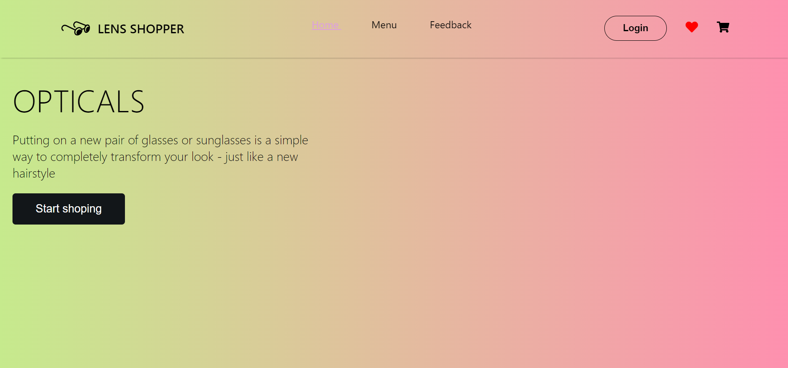
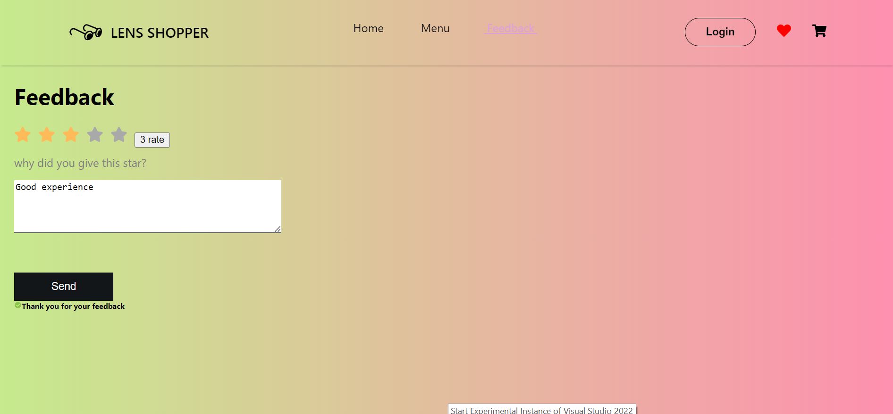
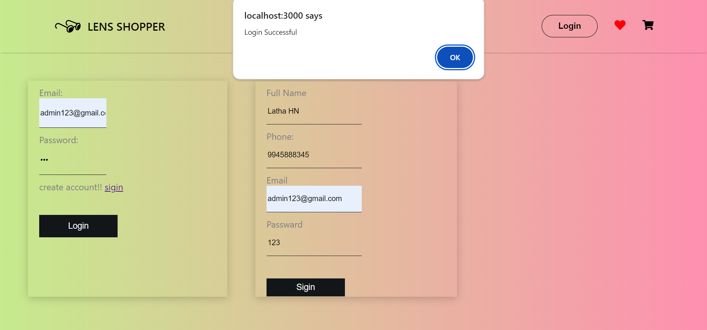
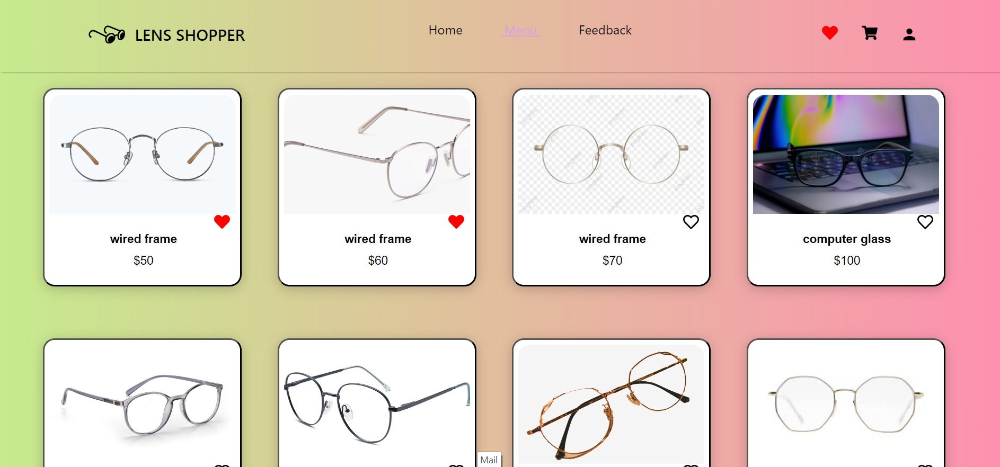
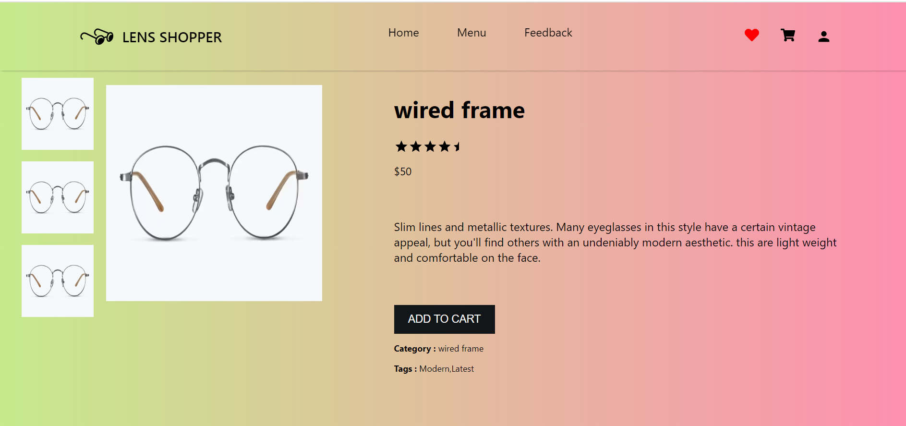
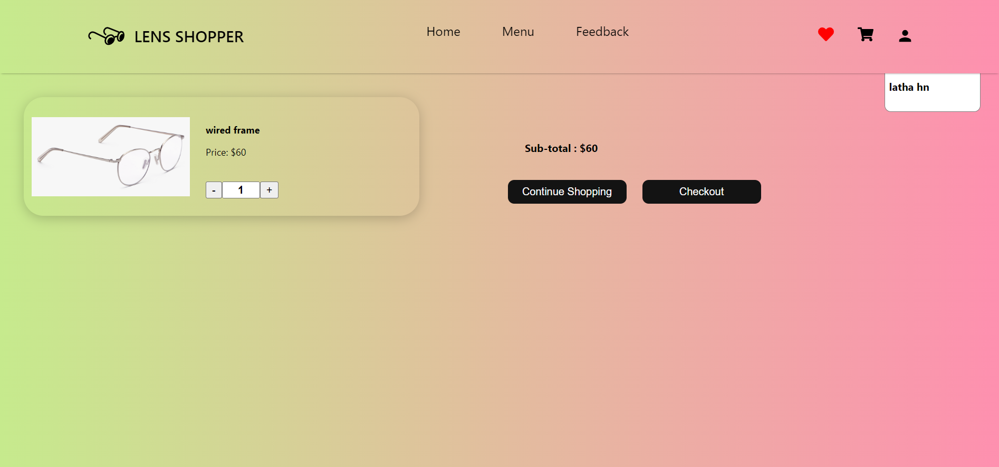
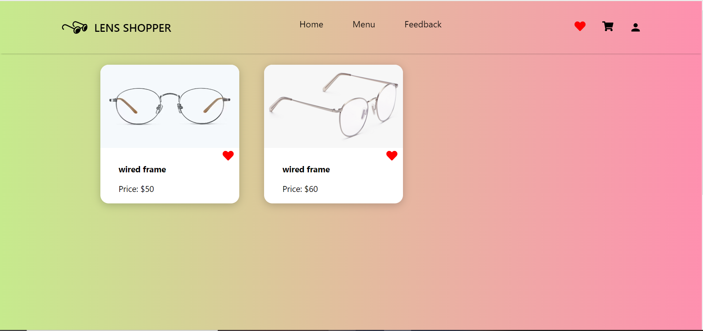
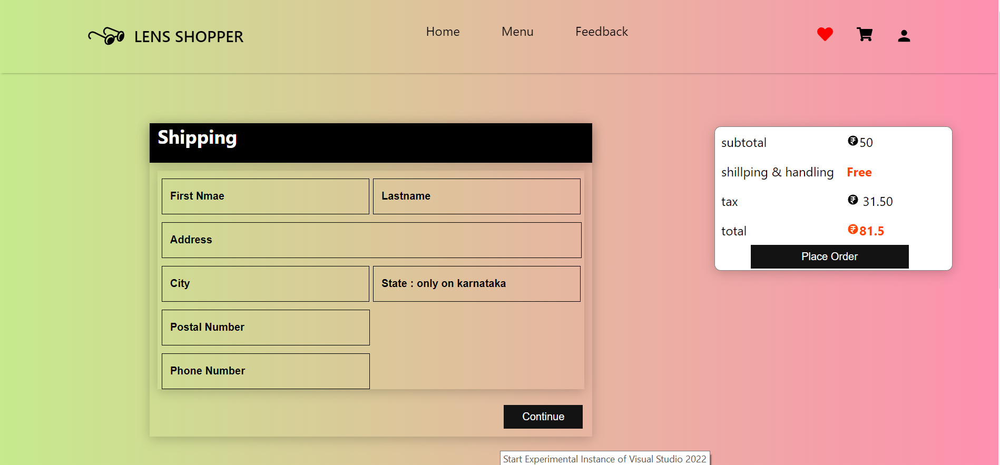

#  Lens Cart

## Project Description
**Lens Cart** is a fully functional e-commerce website designed using the **React.js** framework and **CSS**. This project was developed using **Visual Studio Code** and does not have a backend server; instead, it utilizes **localStorage** to manage user login details. After installation, users can extract the project files and run the project through Visual Studio Code.


## Installation
To install and set up the Lens Cart project, follow these steps:

1. **Clone the repository**:
    ```bash
    git clone https://github.com/your-username/lens-cart.git
    ```

2. **Navigate to the project directory**:
    ```bash
    cd lens-cart
    ```

3. **Install dependencies**:
    Open the terminal in Visual Studio Code and run:
    ```bash
    npm install
    ```

4. **Ensure React and React-DOM are installed**:
    If they are not already included, install them explicitly:
    ```bash
    npm install react react-dom
    ```

5. **Run the project**:
    Start the development server:
    ```bash
    npm start
    ```

6. **Open in Browser**:
    Open your browser and navigate to `http://localhost:3000`.

## Usage
After running the project, you can use the following features:

- **Menu of Lens Products**: Browse a variety of lens products.
- **Like Buttons**: Like items to save them to your like page.
- **Like Page**: View all the items you have liked.
- **Cart Page**: View and manage items in your cart.
- **Sign In/Login Page**: Sign in or log in to your account.
- **Feedback Page**: Provide feedback about your experience.

## Features
- Browse lens products.
- Like items and view them on the "Like" page.
- Add items to the cart and view them on the "Cart" page.
- User sign-in and login functionality.
- Feedback page for user comments and suggestions.

## Technologies Used
- **React.js**
- **CSS**
- **LocalStorage**
- **Visual Studio Code**


## Authors and Acknowledgements
- **Latha HN** - [Your GitHub](https://github.com/Latha56)

## Screenshot

<div style="display: flex; flex-wrap: wrap; justify-content: center;">
  <div style="margin: 10px; text-align: center;">
    
    <p style="margin-top: 5px;">Home Page</p>
  </div>
  
  <div style="margin: 10px; text-align: center;">
    
    <p style="margin-top: 5px;">Feedback Page</p>
  </div>
  
  <div style="margin: 10px; text-align: center;">
    
    <p style="margin-top: 5px;">Login Page</p>
  </div>
  
  <div style="margin: 10px; text-align: center;">
    
    <p style="margin-top: 5px;">Menu Page</p>
  </div>
  
  <div style="margin: 10px; text-align: center;">
    
    <p style="margin-top: 5px;">Product Details Page</p>
  </div>
  
  <div style="margin: 10px; text-align: center;">
    
    <p style="margin-top: 5px;">Cart Page</p>
  </div>
  
  <div style="margin: 10px; text-align: center;">
    
    <p style="margin-top: 5px;">Liked Page</p>
  </div>
  
  <div style="margin: 10px; text-align: center;">
    
    <p style="margin-top: 5px;">Shipping Page</p>
  </div>
</div>


## Future Enhancements
- Add backend functionality for persistent data storage.
- Implement user authentication and authorization.
- Enhance the UI/UX with additional styling and animations.
- Add more features such as order history, product reviews, and more.
